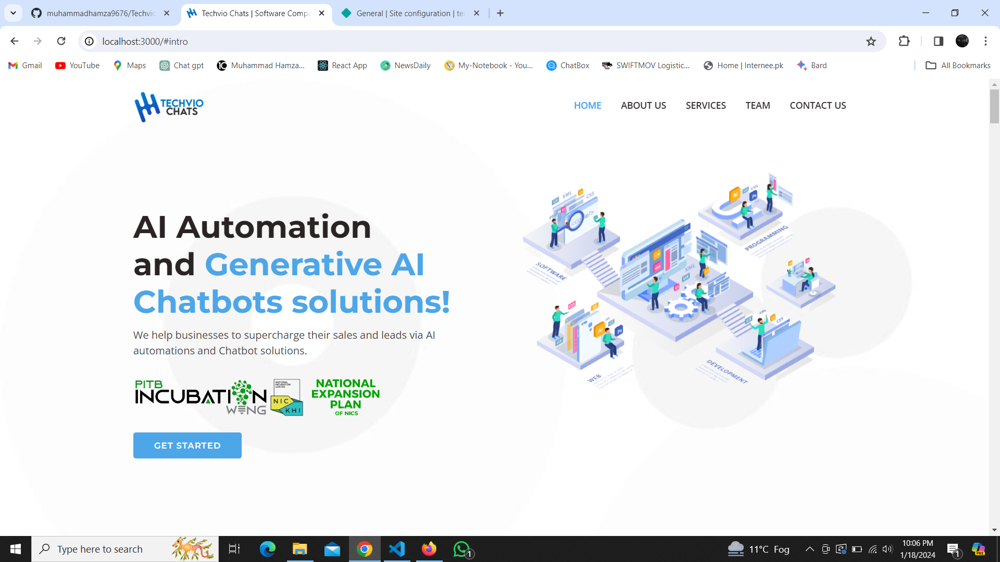

# Techviochats 

## Have a Look:

https://techviochats.netlify.app/
## Run Locally

Clone the project

```bash
  git clone https://github.com/muhammadhamza9676/Techviochats
```

Go to the project directory

```bash
  cd Techviochats
```

Install dependencies

```bash
  npm install
```

Start the server

```bash
  npm run start
```


## Authors

- [@muhammadhamza](https://github.com/muhammadhamza9676)

